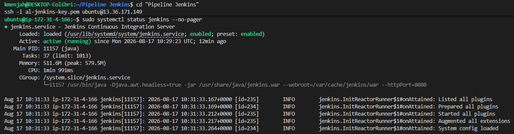
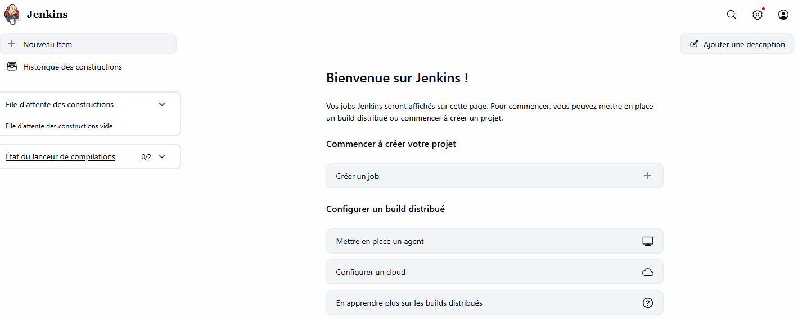

# Fiche de configuration — TP1 : Déployer un serveur Jenkins

## 🖥️ Infrastructure

| Élément | Valeur |
|---|---|
| Instance EC2 | `i-0ce27f61ad122e2c9` (t3.micro, Ubuntu 24.04 LTS) |
| Région | eu-west-3 (Paris) |
| IP publique | 13.36.171.149 |
| Security group | `al-jenkins-sg` — SSH(22) et 8080 restreints à l'IP du poste de travail |
| Clé SSH | `al-jenkins-key.pem` |

## 🔑 Accès Jenkins

| Élément | Valeur |
|---|---|
| URL | http://13.36.171.149:8080 |
| Administrateur nominatif | login `anne-laure` (nom affiché : Admin-al) |
| Java | OpenJDK 21 |
| Version Jenkins | 2.568.2 (LTS) |

## 🟢 Statut du service

```
● jenkins.service - Jenkins Continuous Integration Server
     Loaded: loaded (/usr/lib/systemd/system/jenkins.service; enabled; preset: enabled)
     Active: active (running)
   Main PID: 11157 (java)
```

## 🧩 Plugins essentiels installés (jeu "suggested plugins")

92 plugins installés au total. Les plugins essentiels pour la suite du parcours CI/CD :

- **SCM / Git** : `git`, `git-client`, `github`, `github-api`, `github-branch-source`
- **Pipeline** : `workflow-aggregator`, `workflow-cps`, `workflow-job`, `workflow-multibranch`, `pipeline-model-definition`, `pipeline-build-step`, `pipeline-input-step`
- **Credentials & sécurité** : `credentials`, `credentials-binding`, `ssh-credentials`, `ssh-slaves`, `matrix-auth`, `ldap`, `script-security`
- **Build tools** : `ant`, `gradle`, `junit`
- **Notifications & reporting** : `email-ext`, `mailer`, `timestamper`
- **Nettoyage** : `ws-cleanup`

*(Liste complète des 92 plugins disponible sur demande — extraite de `/var/lib/jenkins/plugins/` sur l'instance.)*

## 📸 Livrables restants à joindre manuellement

- [x] Capture d'écran de `sudo systemctl status jenkins` 

- [x] Capture d'écran de l'écran d'accueil Jenkins 

