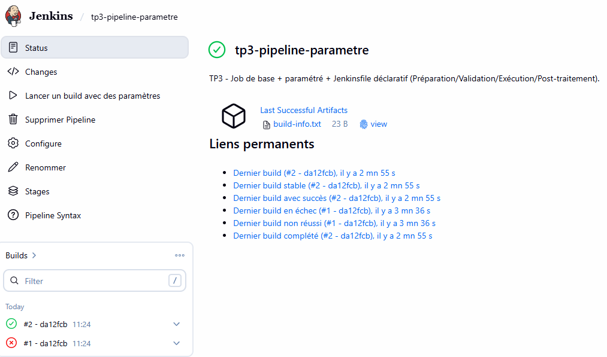
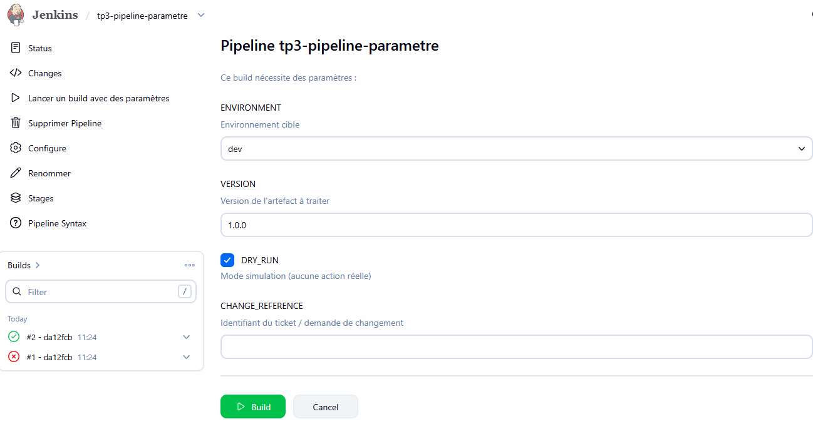

# Fiche de configuration — TP3 : Jobs de base et paramétrés

## Choix d'implémentation

Les parties A (job de base), B (job paramétré) et C (Jenkinsfile) du cahier ont été regroupées en un
**unique Jenkinsfile déclaratif versionné** (`TP_3/Jenkinsfile`), car la partie C reprend et enrichit
les exigences de A et B — c'est ce livrable final qui est évalué. Le job Jenkins est configuré en
**"Pipeline script from SCM"**, pointant sur ce fichier dans le dépôt GitHub : le pipeline est donc
lui-même versionné (objectif 4.1).

## Job créé

| Élément | Valeur |
|---|---|
| Nom | `tp3-pipeline-parametre` |
| Type | Pipeline (script depuis SCM) |
| Repo source | `https://github.com/Anne-LaureS/Pipeline-Jenkins.git` (branche `main`) |
| Script path | `TP_3/Jenkinsfile` |

## Paramètres

| Paramètre | Type | Détail |
|---|---|---|
| `ENVIRONMENT` | choice | `dev`, `test`, `prod` |
| `VERSION` | string | version de l'artefact |
| `DRY_RUN` | boolean | `true` par défaut (simulation) |
| `CHANGE_REFERENCE` | string | obligatoire, validé en stage Validation |

## Stages du Jenkinsfile

1. **Préparation** — `git rev-parse --short HEAD`, nom de build explicite (`#N - hash`), génération et archivage de `artifacts/build-info.txt`.
2. **Validation** — rejette tout `ENVIRONMENT` hors `dev/test/prod`, exige `CHANGE_REFERENCE` non vide, affiche le contexte choisi (aucun secret).
3. **Exécution** — respecte `DRY_RUN` : simulation si `true`, action réelle sinon.
4. **Post-traitement** — trace de fin de traitement liée au ticket.

Options globales : `timeout(10 min)`, `buildDiscarder(numToKeepStr: '10')`, section `post` (always/failure).

## Preuves d'exécution

### Build #1 — `CHANGE_REFERENCE` vide → **FAILURE** (attendu)

```
[Pipeline] { (Validation)
[Pipeline] script
ERROR: CHANGE_REFERENCE est obligatoire (identifiant de ticket / demande de changement).
Finished: FAILURE
```

### Build #2 — paramètres valides → **SUCCESS**

```
Contexte validé : ENVIRONMENT=dev | VERSION=1.2.0 | DRY_RUN=true | CHANGE_REFERENCE=CHG-0001
[DRY_RUN] Simulation du déploiement de la version 1.2.0 sur dev (aucune action réelle).
Fin du traitement pour le changement CHG-0001 (environnement dev).
Build 2 terminé avec le statut : SUCCESS
Finished: SUCCESS
```

### Tentative avec `ENVIRONMENT=staging` (valeur non prévue)

Rejetée **avant même la création du build** — Jenkins renvoie une erreur HTTP 500 au niveau du paramètre
`choice` natif (aucun `build #3` créé). Double protection donc : le paramètre `choice` de l'UI/API
empêche déjà toute valeur hors liste, et la validation explicite du stage **Validation** couvrirait le cas
où `ENVIRONMENT` serait injecté autrement (ex: trigger externe, job amont).

## Critères de réussite couverts

- [x] Nom de build explicite incluant numéro de build + hash court du commit.
- [x] Artefact `build-info.txt` généré et archivé.
- [x] Environnements non prévus refusés (double contrôle : `choice` param + validation script).
- [x] Contexte affiché sans secret.
- [x] Jenkinsfile déclaratif avec 4 stages, `timeout`, section `post`, rétention limitée des builds.

## Livrables restants à joindre manuellement

- [x] Capture d'écran du job `tp3-pipeline-parametre` (vue d'ensemble avec build #1 FAILURE et #2 SUCCESS)

- [x] Capture d'écran de la page de paramètres ("Build with Parameters")
