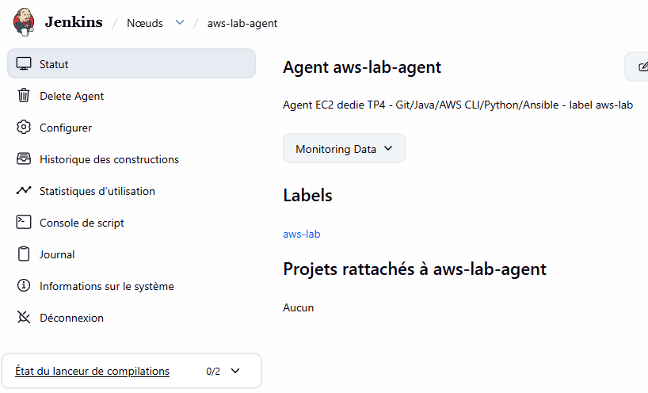
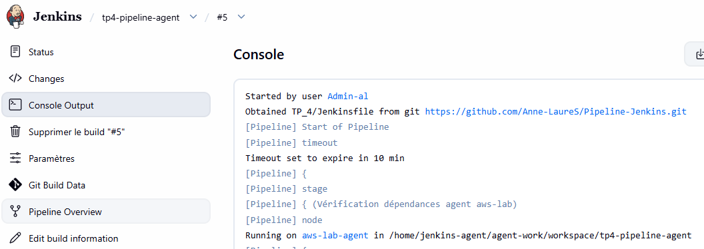
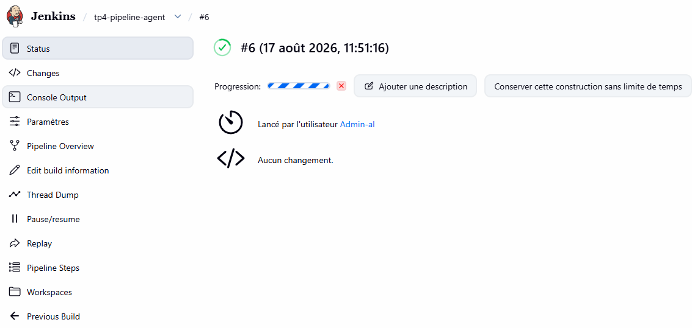
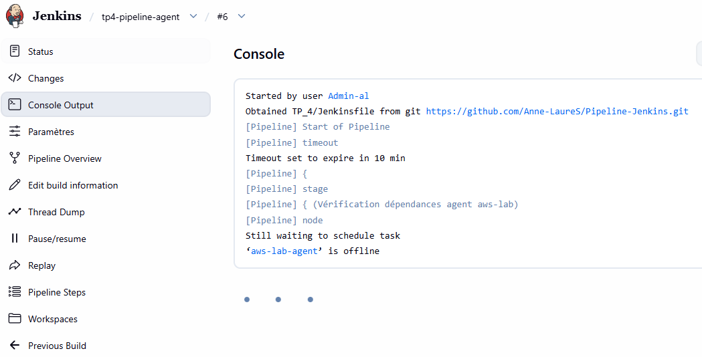

# Fiche de configuration — TP4 : Nœuds Jenkins et jobs interopérés

## Infrastructure

| Élément | Valeur |
|---|---|
| Instance agent | `i-09aa378954c97c60e` (t3.micro, Ubuntu 24.04) |
| IP publique agent | 35.180.87.8 |
| Security group | `al-jenkins-agent-sg` — SSH(22) restreint au poste local et au contrôleur (`13.36.171.149/32`) |
| Compte d'exécution dédié | `jenkins-agent` (créé spécifiquement, pas le compte `ubuntu` par défaut) |
| Connexion Jenkins | SSH, clé dédiée `ssh-jenkins-agent-tp4` (credential Jenkins, clé privée jamais commitée) |

## Nœud Jenkins

| Élément | Valeur |
|---|---|
| Nom | `aws-lab-agent` |
| Label | `aws-lab` |
| Répertoire distant | `/home/jenkins-agent/agent-work` |
| Stratégie de rétention | Always (relance automatique par SSH) |

## Dépendances vérifiées sur l'agent

```
java -version    → OpenJDK 21.0.11
git --version    → git version 2.43.0
aws --version    → aws-cli/2.36.24
python3 --version → Python 3.12.3
ansible --version → ansible [core 2.16.3]
```

## Jobs créés

| Job | Type | Rôle |
|---|---|---|
| `tp4-pipeline-agent` | Pipeline (SCM, `TP_4/Jenkinsfile`) | Job amont : vérifie les dépendances sur `aws-lab`, exécute les stages AWS restreints à ce label, déclenche le job aval |
| `tp4-job-aval` | Pipeline (SCM, `TP_4/Jenkinsfile-downstream`) | Job aval : reçoit uniquement `ENVIRONMENT` et `CHANGE_REFERENCE`, aucun secret |

## Preuve : stages AWS exécutés uniquement sur `aws-lab`

```
[Pipeline] { (Vérification dépendances agent aws-lab)
[Pipeline] node
Running on aws-lab-agent in /home/jenkins-agent/agent-work/workspace/tp4-pipeline-agent
...
[Pipeline] { (Stages AWS (restreints à aws-lab))
[Pipeline] node
Running on aws-lab-agent in /home/jenkins-agent/agent-work/workspace/tp4-pipeline-agent
...
aws sts get-caller-identity
{ "Arn": "arn:aws:iam::622333992348:user/jenkins-lab-al" }
```

## Preuve : job aval reçoit uniquement le contexte (pas de secret)

```
Transmission du contexte au job aval (aucun secret) : ENVIRONMENT=prod, CHANGE_REFERENCE=CHG-TP4-001
[Pipeline] build
Scheduling project: tp4-job-aval
Build tp4-job-aval #3 completed: SUCCESS
```

Le `Jenkinsfile-downstream` ne déclare que deux paramètres (`ENVIRONMENT`, `CHANGE_REFERENCE`) — aucune
variable de credential AWS n'est transmise au job aval.

## Preuve : comportement à l'arrêt de l'agent (test attendu 5.3)

Deux tentatives ont été nécessaires pour bien isoler ce test :

1. **`doDisconnect` (simple coupure de canal)** : la stratégie de rétention SSH "Always" a **automatiquement
   reconnecté l'agent** avant même le déclenchement du build suivant — le build est passé normalement.
   *(Incident noté : une simple coupure réseau/canal ne suffit pas à simuler un arrêt d'agent avec cette
   stratégie de rétention.)*
2. **Mise hors ligne persistante (`toggleOffline`, agent marqué "temporarily offline")** : le build suivant
   reste bloqué en file d'attente avec une raison explicite, sans jamais s'exécuter ailleurs :

   ```json
   {
     "why": "'aws-lab-agent' is offline",
     "stuck": true,
     "task": "part of tp4-pipeline-agent #4"
   }
   ```

   → Comportement conforme : échec/blocage compréhensible (raison explicite affichée), **aucune exécution
   sur un nœud non prévu** (le job amont n'a pas basculé sur le contrôleur). Le build a ensuite été annulé
   manuellement puis l'agent remis en ligne ; un build de contrôle (#5) a confirmé le retour à la normale
   (`SUCCESS`).

## Critères de réussite (section 5.3 du cahier)

- [x] Un build s'exécute sur l'agent étiqueté (`Running on aws-lab-agent`, builds #1, #2, #3, #5).
- [x] L'arrêt de l'agent produit un échec/blocage compréhensible et non une exécution sur un nœud non prévu (`'aws-lab-agent' is offline`, build resté en file, rien exécuté sur le contrôleur).
- [x] Le job aval reçoit le contexte (environnement + ticket) sans recevoir de secret en paramètre.

## Livrables restants à joindre manuellement

- [x] Capture d'écran de la page `Manage Jenkins > Nodes` montrant `aws-lab-agent` en ligne avec le label `aws-lab`

- [x] Capture d'écran du build `tp4-pipeline-agent` montrant `Running on aws-lab-agent`

- [x] Capture d'écran de la file d'attente bloquée (`'aws-lab-agent' is offline`) pendant le test d'arrêt

