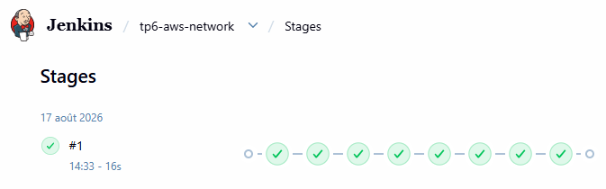
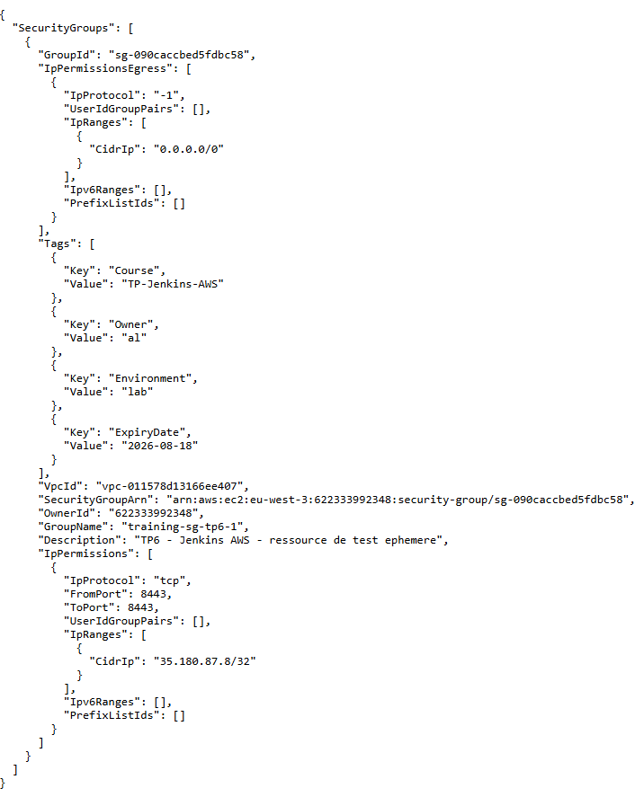

# Fiche de configuration — TP6 : AWS CLI et gestion réseau

## ⚙️ Job créé

| Élément | Valeur |
|---|---|
| Nom | `tp6-aws-network` |
| Type | Pipeline (SCM, `TP_6/Jenkinsfile`) |
| Agent | `aws-lab` |
| Credential AWS | `aws-jenkins-lab` (même identité read-scoped que TP2/TP4) |

## 🌐 VPC de labo utilisé

Identifié dynamiquement via le tag fourni par la plateforme (pas de valeur codée en dur) :

```
aws ec2 describe-vpcs --filters "Name=tag:Training,Values=true" --query "Vpcs[0].VpcId" --output text
→ vpc-011578d13166ee407 (10.10.0.0/16, tags Training=true, Course=AWS-Jenkins-Ansible, Owner=student)
```

Ce VPC est distinct du VPC par défaut où tournent les instances Jenkins (contrôleur + agent) des TP précédents.

## 🪜 Étapes du pipeline

1. **Sélection région et contexte** — `AWS_DEFAULT_REGION=eu-west-3`, identité tracée (`sts get-caller-identity`).
2. **Identification du VPC** — récupération dynamique du VPC taggé `Training=true`.
3. **Création du Security Group** — nom standardisé `training-sg-tp6-<BUILD_NUMBER>` (unique par build), tags obligatoires appliqués : `Owner`, `Course`, `Environment`, `ExpiryDate`.
4. **Règle entrante restreinte** — port `8443` autorisé uniquement depuis l'IP publique de l'agent au moment du build (`/32`), jamais `0.0.0.0/0`.
5. **Vérification et archivage** — `describe-security-groups --output json` archivé comme artefact (`sg-verification.json`).
6. **Nettoyage** — suppression du Security Group en fin de pipeline, commande documentée dans les logs avant exécution.

## 🔒 Preuve : règle non ouverte au monde

```
Autorisation du port 8443 uniquement depuis 35.180.87.8/32 (pas de 0.0.0.0/0)
"IpRanges": [{ "CidrIp": "35.180.87.8/32" }]
```

Seule la règle d'*egress* par défaut d'AWS reste à `0.0.0.0/0` (comportement standard non modifiable pour un SG neuf, sans rapport avec le critère qui porte sur l'*ingress*).

## 🏷️ Preuve : tags obligatoires appliqués

```json
"Tags": [
  {"Key": "Course", "Value": "TP-Jenkins-AWS"},
  {"Key": "Owner", "Value": "al"},
  {"Key": "Environment", "Value": "lab"},
  {"Key": "ExpiryDate", "Value": "2026-08-18"}
]
```

## 🧹 Preuve : suppression effective

```
Commande de suppression : aws ec2 delete-security-group --group-id sg-090caccbed5fdbc58
{ "Return": true, "GroupId": "sg-090caccbed5fdbc58" }
Security Group sg-090caccbed5fdbc58 supprimé.
```

## 📋 Critères de réussite (section 7.3 du cahier)

- [x] Aucune règle entrante ouverte à `0.0.0.0/0`.
- [x] Tags `Owner`, `Course`, `Environment`, `ExpiryDate` appliqués au Security Group.
- [x] Commande de suppression documentée et exécutée (automatiquement en fin de pipeline).
- [x] Sortie de vérification (JSON) archivée comme artefact Jenkins.

## 📸 Livrables restants à joindre manuellement

- [x] Capture d'écran du build `tp6-aws-network` (toutes les stages en vert)

- [x] Capture d'écran de l'artefact `sg-verification.json` archivé

