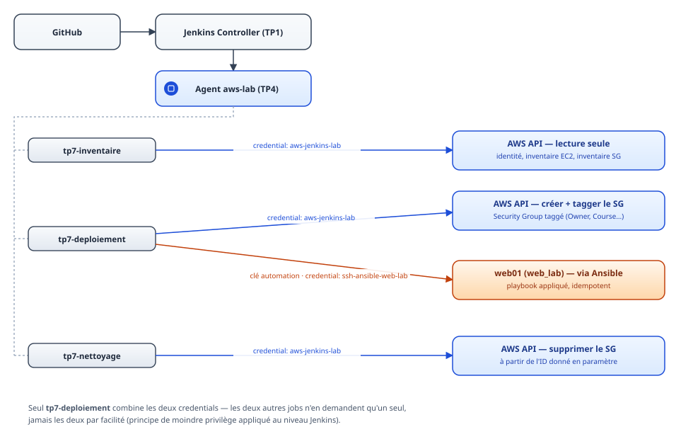
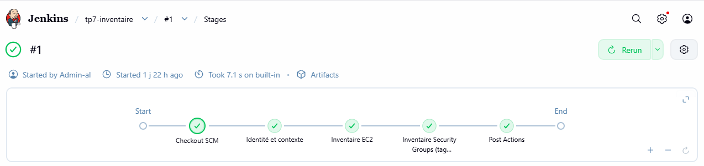
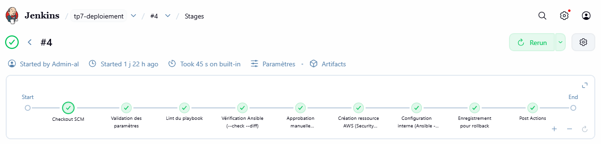
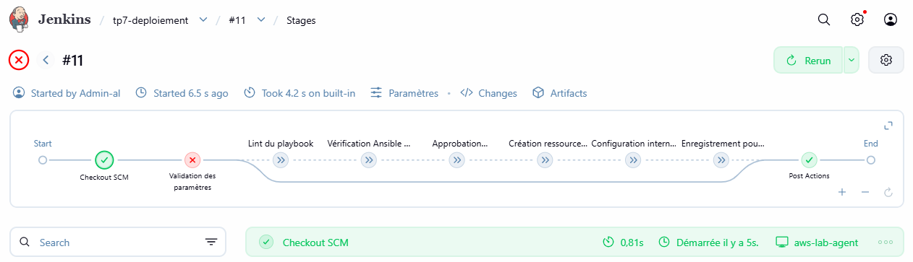
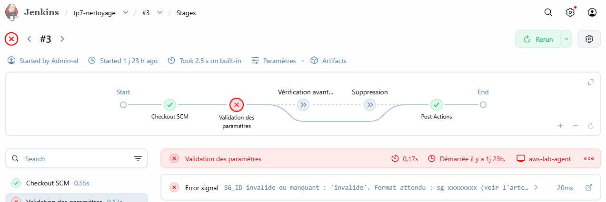
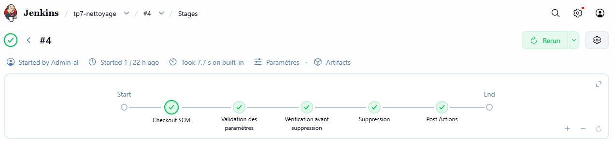
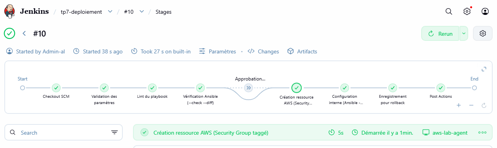
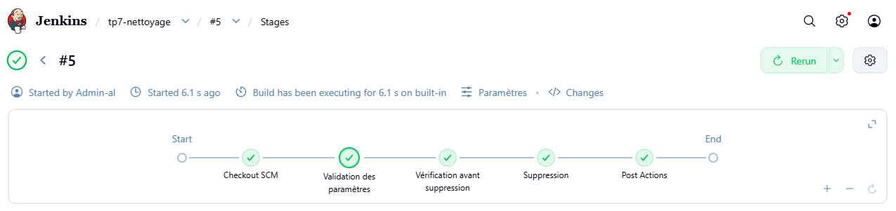

# Rapport de mise en œuvre — TP7 : Projet global Jenkins et Ansible

> 📌 Ce rapport répond également à la consigne du **TP de groupe**, redéfinie par le formateur pour
> reprendre le même périmètre (catalogue de jobs AWS/Ansible traçable, protégé par un contrôle de
> droits, avec rollback). Le livrable initial du TP de groupe (application web + base de données) est
> conservé à part, en bonus, dans `TP_Bonus/`.

## 🏗️ 1. Architecture

```
Développeur (Anne-Laure)
        │
        ▼
   GitHub (Pipeline-Jenkins)
        │
        ▼
Jenkins (contrôleur, TP1) ── job Jenkins ──► Agent aws-lab (TP4)
        │                                          │
        │                                          ├─ AWS CLI (jenkins-lab-al)
        │                                          └─ Ansible (clé automation)
        ▼                                          │
  3 jobs du catalogue :                             ▼
  - tp7-inventaire      (lecture seule)      Cible web_lab (contrôleur TP1,
  - tp7-deploiement      (création + config)  réutilisé — cf. TP5)
  - tp7-nettoyage        (suppression)
```

<figure>
  
  <figcaption><i>Détail par job de quel credential touche quelle ressource — la séparation des responsabilités
  décrite en section 3 (sécurité) rendue visible : deux jobs sur trois n'utilisent qu'un seul credential,
  jamais les deux par facilité.</i></figcaption>
</figure>

Le dépôt est structuré comme demandé par le cahier (8.3) :

```
TP_7/
├── jobs/
│   ├── Jenkinsfile-inventaire
│   ├── Jenkinsfile-deploiement
│   └── Jenkinsfile-nettoyage
├── playbooks/
│   └── site.yml
├── inventory/
│   └── hosts.ini
└── docs/
    └── rapport-TP7.md
```

## 📚 2. Le catalogue de jobs

| Job | Rôle | Paramètres | Ressources touchées |
|---|---|---|---|
| `tp7-inventaire` | Liste les ressources AWS (identité, instances EC2, Security Groups du cours) | aucun | Lecture seule |
| `tp7-deploiement` | Lint + `--check --diff` + approbation conditionnelle + création d'un Security Group taggé + configuration Ansible réelle + enregistrement d'un artefact de rollback | `ENVIRONMENT`, `CHANGE_REFERENCE` | Crée 1 Security Group, applique le playbook sur `web_lab` |
| `tp7-nettoyage` | Supprime une ressource créée par `tp7-deploiement`, à partir de son ID | `SG_ID`, `CHANGE_REFERENCE` | Supprime 1 Security Group |

## 🔐 3. Sécurité

- **Rôles IAM dédiés par fonction — limitation rencontrée et traitement** : le compte AWS de labo (fourni
  par le formateur, pas AWS Academy) interdit toute gestion IAM en self-service (`iam:CreateUser`, `iam:CreateRole` refusés —
  incident déjà rencontré et documenté au TP2). Il n'a donc pas été possible de créer une identité AWS
  distincte par job. **Mesure compensatoire** : séparation de la responsabilité au niveau Jenkins plutôt
  qu'IAM — chaque job ne demande que le credential dont il a besoin (`aws-jenkins-lab` pour les appels AWS
  CLI, `ssh-ansible-web-lab` pour Ansible), aucun job ne mélange les deux inutilement, et les permissions
  réelles de `jenkins-lab-al` ont été vérifiées avant usage (lecture seule + gestion de Security Groups,
  pas de droits IAM).
- **Secrets** : aucune clé ni credential en clair dans le code ou les logs (masquage Jenkins vérifié sur
  chaque job, `withCredentials` systématique).
- **Réseau** : toute règle entrante créée est restreinte à une IP `/32` précise, jamais `0.0.0.0/0`
  (repris de la logique validée au TP6).
- **Tags obligatoires** appliqués à chaque ressource créée : `Owner`, `Course`, `Environment`,
  `ExpiryDate`, `ChangeReference`.
- **Constat de sécurité additionnel** : `tp7-inventaire` révèle que le compte de labo est partagé par
  toute la classe et que `jenkins-lab-al` peut lister les instances EC2 de tous les autres étudiants
  (`ec2:DescribeInstances` non scoping par tag/owner). C'est une limite de la plateforme de labo, pas de
  notre configuration, mais à signaler : dans un contexte réel, une politique IAM scoperait les
  `Describe*` par tag `Owner`.
- **Constat de sécurité additionnel (2)** : le compte IAM généré par le formateur pour l'auteure
  (`user5`) est membre d'un groupe `FormationAdmins` accordant `AdministratorAccess`, vérifié via
  `aws iam list-groups-for-user --user-name user5` (CloudShell) — l'appartenance n'a pas été demandée et
  le groupe a été créé le jour même de l'ouverture du labo (2026-08-17), ce qui suggère une appartenance
  par défaut appliquée à tous les comptes étudiants plutôt qu'un opt-in individuel. Ceci contredit
  directement le principe de moindre privilège appliqué au job Jenkins (voir point ci-dessus) et
  constitue vraisemblablement une erreur de configuration de la plateforme partagée.
  **Vérification et décision** : `jenkins-lab-al` (le compte technique utilisé par Jenkins, distinct du
  compte `user5`) a été confirmé hors de tout groupe IAM — son scope reste limité à ses seuls droits
  vérifiés (lecture EC2 + gestion Security Groups). Le droit `AdministratorAccess` hérité sur `user5`
  n'a été utilisé à aucun moment de ce TP.

## ⚙️ 4. Automatisation

- **Playbook idempotent** (`playbooks/site.yml`) : testé en mode `--check --diff` avant toute exécution
  réelle dans `tp7-deploiement`, et validé directement sur TP7 par un run répété sur cible déjà
  configurée (`ok=4, changed=0` sur les deux étapes Ansible — voir section 5, "Preuve d'idempotence").
- **Contrôles intégrés** : `ansible-lint` (0 échec), validation des paramètres obligatoires
  (`CHANGE_REFERENCE`), approbation manuelle conditionnelle (`ENVIRONMENT != dev`), validation de format
  sur `SG_ID` dans le job de nettoyage (regex `sg-[0-9a-f]+`).
- **Logs et archivage** : chaque job archive ses sorties en artefacts Jenkins (lint, check/diff, apply,
  inventaires JSON, preuve avant suppression).
- **Stratégie de retour arrière (rollback)** : `tp7-deploiement` enregistre systématiquement un artefact
  `deployed-resources.json` contenant l'ID de la ressource créée et la commande de suppression exacte à
  utiliser. `tp7-nettoyage` consomme cet ID en paramètre — l'opérateur retrouve la commande de rollback
  directement dans l'historique des builds, sans avoir à deviner quoi que ce soit.

## ✅ 5. Preuves d'exécution (résumé)

| Test | Résultat |
|---|---|
| `tp7-inventaire` | SUCCESS — identité, 19 instances EC2 recensées, 0 SG taggé Course (nettoyage précédent effectif) |
| `tp7-deploiement` (paramètres invalides) | FAILURE attendue — `CHANGE_REFERENCE` obligatoire |
| `tp7-deploiement` (`dev`) | SUCCESS — pas d'approbation requise, SG créé+taggé, playbook appliqué |
| `tp7-deploiement` (`prod`) | SUCCESS — approbation manuelle déclenchée et validée avant action réelle |
| `tp7-nettoyage` (`SG_ID` invalide) | FAILURE attendue — garde-fou de format |
| `tp7-nettoyage` (ID valide, x2) | SUCCESS — ressources supprimées, aucune ressource orpheline restante |


*`tp7-inventaire` #1 — checkout, identité AWS, inventaire EC2, inventaire Security Groups.*


*`tp7-deploiement` #4 — lint, vérification `--check --diff`, approbation manuelle, création de
ressource, configuration Ansible, enregistrement pour rollback.*


*`tp7-deploiement` #11 — build rejeté dès la validation des paramètres (`CHANGE_REFERENCE`
manquant), avant même le lint : aucune étape AWS ou Ansible n'est atteinte.*


*`tp7-nettoyage` #3 — `SG_ID=invalide` rejeté dès la validation des paramètres (`Error signal:
SG_ID invalide ou manquant`), avant tout appel AWS : le garde-fou de format fonctionne réellement.*


*`tp7-nettoyage` #4 — validation des paramètres, vérification avant suppression, suppression.*

### 🔁 Preuve d'idempotence (directe, sur TP7)

`tp7-deploiement` #9, relancé avec les mêmes paramètres sur une cible déjà configurée par un run
précédent — les deux étapes Ansible (`--check --diff` **et** exécution réelle) confirment qu'aucune
tâche ne modifie l'hôte :

```
TASK [Gathering Facts] *********************************************************
ok: [web01]
TASK [Installer curl] **********************************************************
ok: [web01]
TASK [Créer le répertoire de preuve] *******************************************
ok: [web01]
TASK [Déposer le fichier de preuve] ********************************************
ok: [web01]

PLAY RECAP *********************************************************************
web01    : ok=4    changed=0    unreachable=0    failed=0    skipped=0    rescued=0    ignored=0
```

`ok=4, changed=0` sur les deux étapes : le playbook constate que l'état désiré est déjà atteint,
sans rien modifier — c'est la définition même de l'idempotence, vérifiée en conditions réelles
(hôte réellement joint en SSH, pas une simulation).


*`tp7-deploiement` #10 — nouveau run identique, toutes les étapes passent en quelques secondes.*

### ↩️ Preuve de retour en arrière (rollback), de bout en bout

1. `tp7-deploiement` #9 crée et tague un Security Group, puis enregistre l'artefact
   `deployed-resources.json` :
   ```json
   {
     "build_number": "9",
     "environment": "dev",
     "change_reference": "idempotence-test-2",
     "security_group_id": "sg-0d37ba42331a9b17f",
     "vpc_id": "vpc-04c76f12d2bc944a2",
     "deployed_at_utc": "2026-08-19T11:46:26Z",
     "rollback_command": "aws ec2 delete-security-group --group-id sg-0d37ba42331a9b17f"
   }
   ```
2. `tp7-nettoyage` est relancé avec `SG_ID=sg-0d37ba42331a9b17f` (lu directement dans l'artefact
   ci-dessus, sans avoir à deviner ou reconstruire l'information) et `CHANGE_REFERENCE=idempotence-test-2` :


*`tp7-nettoyage` #5 — le Security Group `sg-0d37ba42331a9b17f` créé par le déploiement #9 est
supprimé avec succès, bouclant la chaîne déploiement → artefact → retour en arrière.*

**Incident rencontré et corrigé** : la première exécution de `tp7-deploiement` a échoué sur les étapes
Ansible (`playbook not found`) — chemins relatifs erronés dans le Jenkinsfile (oubli du préfixe `TP_7/`
après le checkout SCM du dépôt complet). Corrigé en un commit, ressource orpheline nettoyée manuellement,
puis build rejoué avec succès.

## ✨ 6. Qualité

- Nommage cohérent avec les TP précédents (`tp7-*`, mêmes conventions de tags, mêmes credentials réutilisés).
- Un Jenkinsfile par job (lisibilité), plutôt qu'un unique pipeline monolithique.
- Playbook et inventaire versionnés et réutilisables indépendamment des jobs.