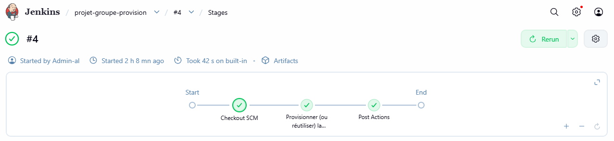
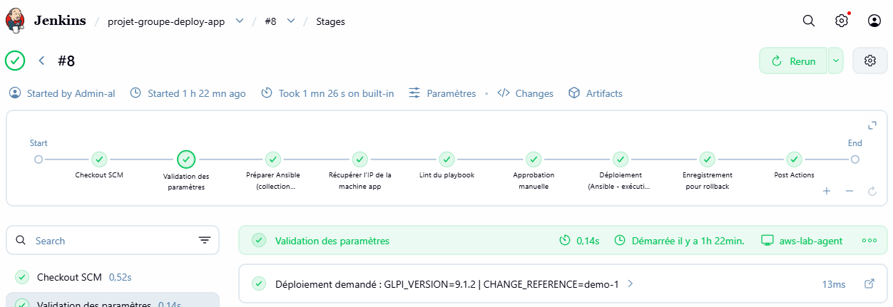
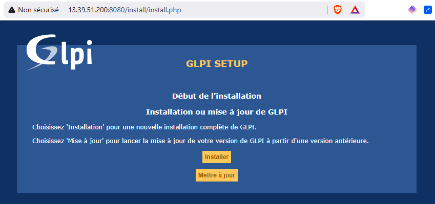
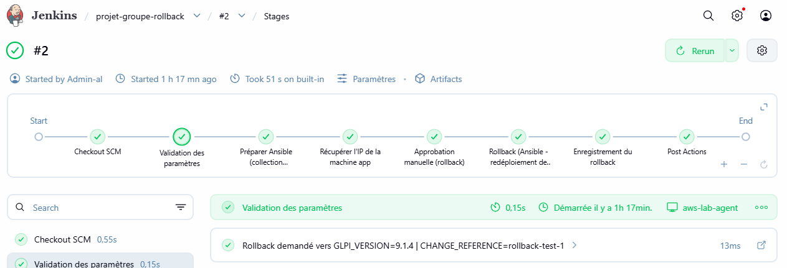

# Rapport — TP Bonus : application web + base de données

## 🎯 Contexte (consigne initiale du formateur pour le TP de groupe, remplacée depuis)

> Mettre en place une application web, connectée à une base de données, via une chaîne de
> production, pouvoir déployer une nouvelle machine et version, et pouvoir faire un retour
> en arrière.

Le formateur a depuis redéfini le TP de groupe (voir `TP_7/docs/rapport-TP7.md`, dont le contenu
existant répond déjà à la nouvelle consigne). Ce livrable est conservé à part, en **bonus**, dans
`TP_Bonus/` — fonctionnel et testé (déploiement + rollback validés en conditions réelles), mais
non requis pour la notation du TP de groupe.

## 🏗️ Architecture

```
                    Jenkins (contrôleur, réutilisé depuis TP1)
                              │
        ┌─────────────────────┼─────────────────────┐
        ▼                     ▼                      ▼
  Jenkinsfile-provision  Jenkinsfile-deploy-app  Jenkinsfile-rollback
        │                     │                      │
        ▼                     └──────────┬───────────┘
  provision-app-ec2.sh                   ▼
        │                    Ansible (playbooks/deploy-app.yml)
        ▼                                │
  Nouvelle instance EC2                  ▼
  (al-glpi-app, t3.small)   Docker Compose : GLPI (app) + MySQL (db)
```

- **Application** : [GLPI](https://glpi-project.org/) (gestion de parc IT/helpdesk, PHP), image Docker
  `diouxx/glpi`, tag = version déployée
- **Base de données** : MySQL 8.0, conteneur dédié, volume Docker persistant
- **Nouvelle machine** : chaque environnement applicatif tourne sur sa propre instance EC2
  (`al-glpi-app`), distincte de `web_lab` (réutilisée pour le TP7 individuel)

## 📚 Catalogue de jobs

| Job | Rôle | Paramètres | Idempotent ? |
|---|---|---|---|
| `Jenkinsfile-provision` | Crée l'instance EC2 dédiée à l'app (ou la réutilise si déjà présente) | aucun | Oui — relançable sans dupliquer la ressource |
| `Jenkinsfile-deploy-app` | Déploie/met à jour GLPI + MySQL via Ansible, à la version demandée | `GLPI_VERSION`, `CHANGE_REFERENCE` | Oui — `docker compose up` ne recrée que ce qui a changé |
| `Jenkinsfile-rollback` | Redéploie une version antérieure de GLPI | `TARGET_VERSION`, `CHANGE_REFERENCE` | Oui — réutilise le même mécanisme que le déploiement |

**Retour en arrière** : chaque déploiement archive un artefact `deployed-version.json`
(version, référence de changement, horodatage). Pour revenir en arrière, on relance
`Jenkinsfile-rollback` avec `TARGET_VERSION` = la version lue dans le dernier
`deployed-version.json` connu comme fonctionnel.

**Nouvelle machine** : `Jenkinsfile-provision` est un job séparé et idempotent — il ne fait
qu'une seule chose (garantir que la machine cible existe), sans dupliquer les ressources
AWS à chaque exécution. `Jenkinsfile-deploy-app`/`Jenkinsfile-rollback` retrouvent l'IP de
cette machine par eux-mêmes via l'API AWS (tag `Name=al-glpi-app`), sans dépendre d'un
fichier partagé entre jobs.

## 🔐 Sécurité

- **Secrets externalisés** : `GLPI_DB_ROOT_PASSWORD` et `GLPI_DB_PASSWORD` ne sont jamais en dur
  — stockés comme credentials Jenkins (`glpi-db-root-password`, `glpi-db-password`, type "Secret
  text"), injectés via un fichier `.env` généré à la volée sur la machine cible (mode `0600`,
  jamais commité, `no_log: true` sur la tâche Ansible correspondante).
- **Réseau restreint** : le Security Group de l'app (`al-glpi-app-sg`) n'autorise que le SSH (22)
  depuis l'IP de l'**agent Jenkins** (c'est lui qui exécute `ansible-playbook`, pas le contrôleur),
  et le port applicatif (8080) uniquement depuis l'IP de l'opérateur (paramètre `OPERATOR_IP` du
  job `Jenkinsfile-provision`) — jamais `0.0.0.0/0`, cohérent avec la pratique déjà appliquée en
  TP6. `provision-app-ec2.sh` réconcilie ces 2 règles à **chaque exécution** (retire l'ancienne
  IP, autorise la courante) — relancer `Jenkinsfile-provision` avec l'`OPERATOR_IP` du jour suffit
  après un redémarrage de l'agent ou un changement de connexion réseau.
- **Utilisateur dédié** : la machine app utilise le même compte `automation` (non-root, clé SSH
  dédiée) déjà utilisé pour `web_lab` — pas de nouvelle paire de clés à gérer.
- **Approbation manuelle obligatoire** avant tout déploiement ou rollback réel.

## ⚙️ Prérequis Jenkins (credentials à créer avant le premier run)

| Credential ID | Type | Contenu |
|---|---|---|
| `aws-jenkins-lab` | Username with password | déjà existant (réutilisé) |
| `ssh-ansible-web-lab` | SSH Username with private key | déjà existant (réutilisé) |
| `glpi-db-root-password` | Secret text | mot de passe root MySQL (à générer, ex: `openssl rand -base64 24`) |
| `glpi-db-password` | Secret text | mot de passe de l'utilisateur applicatif `glpi` (à générer) |

## 🧹 Nettoyage

Pour supprimer l'instance app en fin de projet :
```bash
aws --profile jenkins-lab --region eu-west-3 ec2 terminate-instances \
  --instance-ids <ID de al-glpi-app>
```

## ✅ Preuves d'exécution

| Test | Résultat |
|---|---|
| `projet-groupe-provision` | SUCCESS — instance `al-glpi-app` créée (t3.small), Security Group dédié |
| `projet-groupe-deploy-app` (`GLPI_VERSION=9.1.2`) | SUCCESS — Docker installé, GLPI+MySQL déployés, app accessible en HTTP 200 |
| `projet-groupe-rollback` (`TARGET_VERSION=9.1.4`) | SUCCESS — redéploiement de la version antérieure via le même playbook |

**⚠️ Points d'attention si vous réutilisez ce pipeline** (résolus ici, détail dans l'historique git) :
- Toujours faire suivre `set -euo pipefail` avant un `| tee` dans un `sh` Jenkins — sinon un échec
  d'`ansible-playbook` peut être masqué et Jenkins rapporte un faux succès
- Bien identifier quelle IP (agent vs opérateur) va dans quelle règle de Security Group — l'auto-détection
  doit interroger le bon hôte
- La collection Ansible `community.docker` doit être installée dans le même chemin que celui utilisé par
  `ansible-lint` (environnements Python isolés sinon)
- Vérifier les tags réels disponibles sur `diouxx/glpi` avant de fixer une version (`9.1.x`, `latest` —
  pas de `10.0.x`)


*`projet-groupe-provision` #4 — checkout, provisionnement (ou réutilisation) de l'instance
`al-glpi-app`.*


*`projet-groupe-deploy-app` #8 — checkout, validation des paramètres, préparation Ansible,
récupération de l'IP de la machine app, lint, approbation manuelle, déploiement réel
(`GLPI_VERSION=9.1.2`), enregistrement pour rollback.*


*Preuve d'accès réel à l'application déployée par le pipeline — écran d'installation GLPI.*


*`projet-groupe-rollback` #2 — retour vers `GLPI_VERSION=9.1.4` via le même mécanisme que le
déploiement, approbation manuelle incluse.*